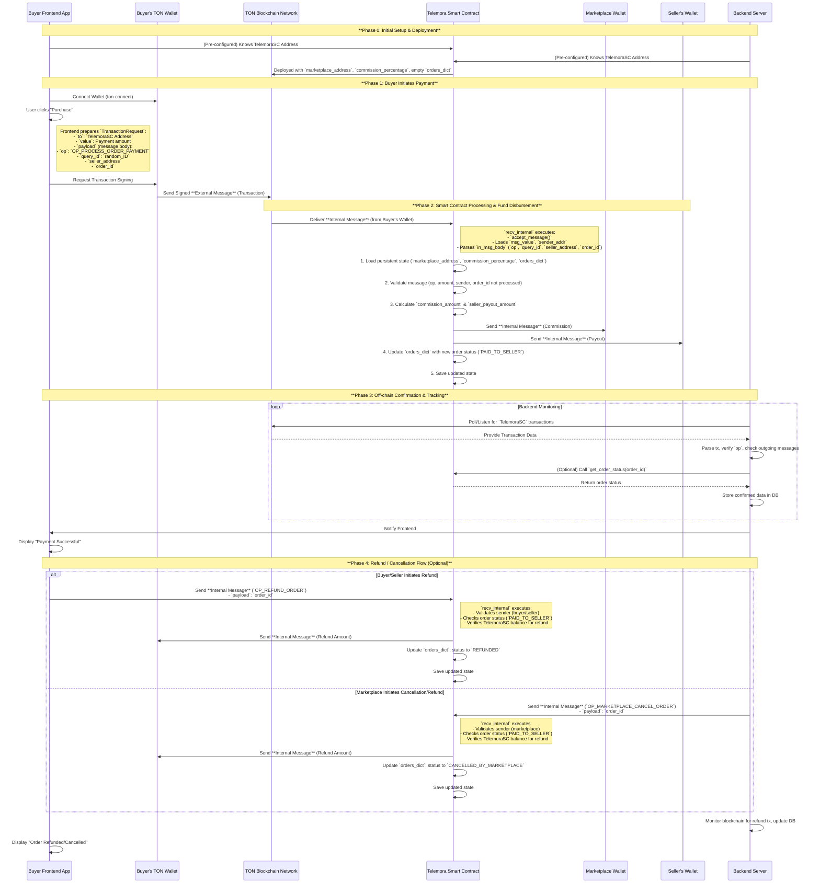

```mermaid
sequenceDiagram
    participant BuyerApp as Buyer Frontend App
    participant BuyerWallet as Buyer's TON Wallet
    participant TONNetwork as TON Blockchain Network
    participant TelemoraSC as Telemora Smart Contract
    participant MarketplaceWallet as Marketplace Wallet
    participant SellerWallet as Seller's Wallet
    participant BackendServer as Backend Server

    Note over BuyerApp, BackendServer: **Phase 0: Initial Setup & Deployment**
    BuyerApp->>TelemoraSC: (Pre-configured) Knows TelemoraSC Address
    BackendServer->>TelemoraSC: (Pre-configured) Knows TelemoraSC Address
    TelemoraSC->>TONNetwork: Deployed with `marketplace_address`, `commission_percentage`, empty `orders_dict`

    Note over BuyerApp, BackendServer: **Phase 1: Buyer Initiates Payment**
    BuyerApp->>BuyerWallet: Connect Wallet (ton-connect)
    BuyerApp->>BuyerApp: User clicks "Purchase"
    Note right of BuyerApp: Frontend prepares `TransactionRequest`:<br>- `to`: `TelemoraSC Address`<br>- `value`: Payment amount<br>- `payload` (message body):<br>  - `op`: `OP_PROCESS_ORDER_PAYMENT`<br>  - `query_id`: `random_ID`<br>  - `seller_address`<br>  - `order_id`
    BuyerApp->>BuyerWallet: Request Transaction Signing
    BuyerWallet->>TONNetwork: Send Signed **External Message** (Transaction)

    Note over TONNetwork, SellerWallet: **Phase 2: Smart Contract Processing & Fund Disbursement**
    TONNetwork->>TelemoraSC: Deliver **Internal Message** (from Buyer's Wallet)
    Note right of TelemoraSC: `recv_internal` executes:<br>- `accept_message()`<br>- Loads `msg_value`, `sender_addr`<br>- Parses `in_msg_body` (`op`, `query_id`, `seller_address`, `order_id`)
    TelemoraSC->>TelemoraSC: 1. Load persistent state (`marketplace_address`, `commission_percentage`, `orders_dict`)
    TelemoraSC->>TelemoraSC: 2. Validate message (op, amount, sender, order_id not processed)
    TelemoraSC->>TelemoraSC: 3. Calculate `commission_amount` & `seller_payout_amount`
    TelemoraSC->>MarketplaceWallet: Send **Internal Message** (Commission)
    TelemoraSC->>SellerWallet: Send **Internal Message** (Payout)
    TelemoraSC->>TelemoraSC: 4. Update `orders_dict` with new order status (`PAID_TO_SELLER`)
    TelemoraSC->>TelemoraSC: 5. Save updated state

    Note over BackendServer, BuyerApp: **Phase 3: Off-chain Confirmation & Tracking**
    loop Backend Monitoring
        BackendServer->>TONNetwork: Poll/Listen for `TelemoraSC` transactions
        TONNetwork-->>BackendServer: Provide Transaction Data
        BackendServer->>BackendServer: Parse tx, verify `op`, check outgoing messages
        BackendServer->>TelemoraSC: (Optional) Call `get_order_status(order_id)`
        TelemoraSC-->>BackendServer: Return order status
        BackendServer->>BackendServer: Store confirmed data in DB
    end
    BackendServer->>BuyerApp: Notify Frontend
    BuyerApp->>BuyerApp: Display "Payment Successful"

    Note over BuyerApp, BackendServer: **Phase 4: Refund / Cancellation Flow (Optional)**
    alt Buyer/Seller Initiates Refund
        BuyerApp->>TelemoraSC: Send **Internal Message** (`OP_REFUND_ORDER`)<br>  - `payload`: `order_id`
        Note right of TelemoraSC: `recv_internal` executes:<br>- Validates sender (buyer/seller)<br>- Checks order status (`PAID_TO_SELLER`)<br>- Verifies TelemoraSC balance for refund
        TelemoraSC->>BuyerWallet: Send **Internal Message** (Refund Amount)
        TelemoraSC->>TelemoraSC: Update `orders_dict`: status to `REFUNDED`
        TelemoraSC->>TelemoraSC: Save updated state
    else Marketplace Initiates Cancellation/Refund
        BackendServer->>TelemoraSC: Send **Internal Message** (`OP_MARKETPLACE_CANCEL_ORDER`)<br>  - `payload`: `order_id`
        Note right of TelemoraSC: `recv_internal` executes:<br>- Validates sender (marketplace)<br>- Checks order status (`PAID_TO_SELLER`)<br>- Verifies TelemoraSC balance for refund
        TelemoraSC->>BuyerWallet: Send **Internal Message** (Refund Amount)
        TelemoraSC->>TelemoraSC: Update `orders_dict`: status to `CANCELLED_BY_MARKETPLACE`
        TelemoraSC->>TelemoraSC: Save updated state
    end
    BackendServer->>BackendServer: Monitor blockchain for refund tx, update DB
    BuyerApp->>BuyerApp: Display "Order Refunded/Cancelled"
```